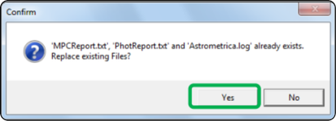

# Primeiros passos

Esta página foi criada para orientar o participante no início da jornada dentro do programa. A primeira etapa é conhecer o site do programa e realizar a instalação do software *Astrometrica*.

Caso queira, pode acompanhar uma versão em vídeo deste processo, disponível no canal do programa no YouTube: [https://www.youtube.com/watch?v=NFQ8b3Fnf0Y](https://www.youtube.com/watch?v=NFQ8b3Fnf0Y).

## Site IASC

O site do programa é o local para instalar o *Astrometrica*, acessar as imagens que serão analisadas e enviar os resultados. O site pode ser acessado aqui: [https://iasc.cosmosearch.org](https://iasc.cosmosearch.org).

Cada devida etapa do treinamento explicará o que fazer no site.

## Download do *Astrometrica*

Dentro do site do IASC, clique na seção denominada **Astrometrica**. Nela, clique no botão *Astrometrica Setup*, de acordo com sua versão do Windows, para iniciar o download.

Após o download, extraia os arquivos da pasta compactada e execute o arquivo de instalação *setup.exe*.

Então, apenas siga as instruções do instalador para concluir a instalação do software. Após a instalação, basta abrir o *Astrometrica* através do atalho gerado na área de trabalho.

⚠️ **Atenção:** Não recomendamos que você instale o *Astrometrica* em um local diferente do indicado pelo instalador, para evitar problemas de configuração e posterior solução de erros.

Após o software abrir, aperte **Yes** na mensagem para limpar os arquivos de reporte. Isso deverá ocorrer toda vez que abrir o programa, para garantir que os arquivos de análise anteriores sejam limpos e não causem confusão com os novos resultados.

## Configurando o *Astrometrica*

Na primeira vez abrindo o *Astrometrica*, é necessário configurar o software para que ele funcione corretamente. Para isso, siga os passos abaixo:

1. Registro para uso

Você pode utilizar o *Astrometrica* gratuitamente por 100 dias. Entretanto, para uso posterior, é necessário uma licença de registro. Para participantes do programa, a licença é gratuita e enviada por e-mail para o líder da equipe. Se você ainda não recebeu a licença, entre em contato com a equipe de treinamento para solicitar o código de registro.

Para inserir a licença, clique em **Help** → **Registration** e insira o código de registro fornecido.

2. Configuração

Clique no primeiro ícone da barra superior para acessar as configurações do software. 🔧 **Edit Program Settings**.

- Nele, vá para a aba **Program** e selecione como **Star Catalog** a opção **Gaia DR1**;
- Depois, na aba **CCD**, em **Color Band**, selecione a opção **Gaia Broadband (G)**;
- Por fim, é necessáiro escolher o arquivo de configuração para análise de imagem. Para isso, clique no botão **Open** (se necessário navegue até a pasta onde o *Astrometrica* foi instalado, depois entre na pasta **Settings**) e selecione o arquivo **PS1.cfg**. Durante a campanha, as imagens podem estar na configuração PS1 ou PS2, indicada no nome de cada imagem. Sempre que necessário, repita esse processo para configurar o arquivo correto para a imagem que irá analisar. Isto será melhor descrito mais a frente.
- Clique em **Save** e depois em **OK** para concluir a configuração.

Agora, novamente na página geral do software, clique no ícone oitavo ícone da barra superior **Select Markings**. A imagem abaixo mostra a configuração recomendada para esta etapa, com as opções de marcação indicadas. Depois de configurar, clique em **Ok** para concluir.

Ao fim, no canto infeiror direito da tela, as configurações devem estar sendo mostradas da seguinte maneira:

Pronto! Seu software está configurado para começar a análise de imagens. Nas próximas etapas, você aprenderá como acessar as imagens, abrir no *Astrometrica* e seguir o fluxo geral de análise para obter os resultados esperados. Boa caçada! 🧑‍🚀☄️

## Próximo passo

Depois de concluir esta preparação inicial, avance para a parte prática da documentação, especialmente a página **Fluxo geral de análise**, onde o processo completo será explicado de forma organizada.