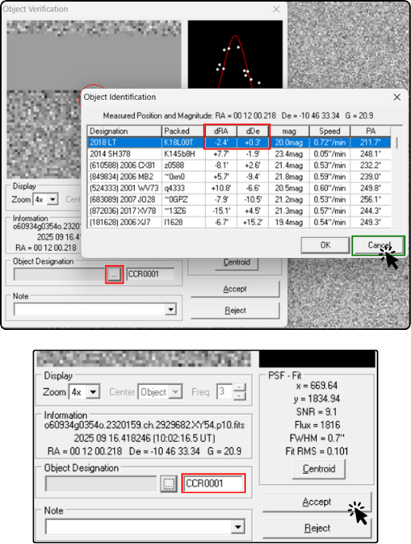

# Marcando um asteroide

É muito importante que os participantes entendam que nem todo objeto que aparenta se mover nas imagens é um asteroide. Existem diversos artefatos e fenômenos que podem gerar falsos positivos, ou seja, sinais que parecem indicar a presença de um asteroide, mas na verdade são causados por outros fatores. Por isso, é fundamental aprender a identificar esses sinais e diferenciá-los de um asteroide real.

## Identificando um asteroide

Para identificar um objeto como um asteroide, é necessário que ele apresente as seguintes características:

- Move-se em linha reta
- Move-se a uma velocidade constante
- Aparece em pelo menos três das quatro imagens
- Mantém o mesmo brilho e formato em todas as imagens

Podemos observar um exemplo de um objeto que apresenta essas características:

Neste exemplo, o objeto em questão se move em linha reta, a uma velocidade constante, aparece em todas as imagens e mantém o mesmo brilho e formato. Esses são sinais fortes de que se trata de um asteroide. ⚠️: Entretanto, aqui ele aparece 6 vezes. Nos casos que trabalhamos, o máximo de vezes que um objeto pode aparecer é 4, pois são 4 imagens.

Certo, confirmado como identificar um asteroide, vamos aprender a marcá-lo no *Astrometrica* para que ele seja incluído no relatório de análise.

## Marcando um asteroide

O processo de marcar um asteroide no *Astrometrica* é bastante simples. Para facilitar a visualização, é recomendado utilizar a barra de controle do GIF, que permite pausar e avançar quadro a quadro, para observar o movimento do objeto com mais precisão.

Primeiro, é necessário clicar com o mouse sobre o objeto que se deseja marcar.

Então, clique no botão com reticências (...) que aparece ao lado de *Object Designation* para observar os objetos próximos. Então, existem duas opções: (a) O objeto está próximo de um objeto conhecido, ou seja, um asteroide já catalogado, e (b) O objeto não está próximo de nenhum objeto conhecido.

### Caso (a): O objeto está próximo de um objeto conhecido

- O objeto no topo da lista é o mais próximo do objeto que você marcou. Se os valores em *dRa* e *dDec* forem menores que 0.2, isso indica que o objeto que você marcou é muito próximo de um objeto conhecido, ou seja, um asteroide já catalogado. Nesse caso, selecione o objeto e clique em **Ok**. O objeto que você marcou será automaticamente associado ao objeto conhecido.

- Depois de clicar em **Ok**, o nome catalogado aparecerá automaticamente no campo *Object Designation*. Não mude esse nome e clique em **Accept**.

### Caso (b): O objeto não está próximo de nenhum objeto conhecido

- Se o objeto que você marcou não estiver próximo de nenhum objeto conhecido, ou seja, se os valores em *dRa* e *dDec* forem maiores que 0.2, isso indica que o objeto que você marcou é um candidato a asteroide novo. Nesse caso, clique em **Cancel** para fechar a janela de objetos próximos.

- Dê um nome para o objeto inserindo 3 letras (normalmente, representando as iniciais do nome da equipe) seguidas de 4 números, por exemplo, *ABC0001*. Depois, clique em **Accept** para confirmar o nome do objeto. 

- ⚠️ O nome **deve** ser de 3 letras e 4 números. Normalmente, indicamos que nomeie em sequência as descobertas durante a campanha, começando com 0001, depois 0002, e assim por diante. Isso facilita a organização e o acompanhamento dos objetos marcados.

Em ambos os casos, você deve repetir o procedimento de nomeação para todas as aparições do objeto no pacote de imagens. Ou seja, use o controle do GIF para avançar quadro a quadro e marque o objeto em cada imagem, associando-o ao mesmo nome. Assim, o objeto será corretamente identificado e incluído no relatório de análise.

Pronto, um objeto está nomeado. Contínue procurando outros objetos até ter certeza que encontrou todos os asteroides presentes nas imagens. A próxima etapa é o envio do relatório, então siga para **Enviando relatório**.