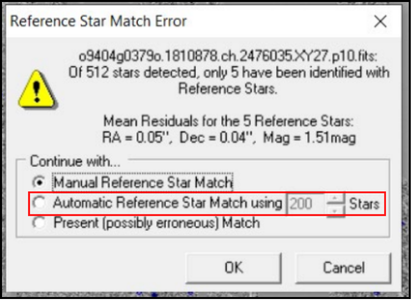

# Problemas relacionados ao Astrometrica

Aqui, encontrará uma lista de problemas relacionados ao uso do software *Astrometrica*, que é a ferramenta utilizada para analisar as imagens e identificar os asteroides. Se você estiver enfrentando algum problema relacionado ao uso do *Astrometrica*, como erros de calibração, erros com arquivos e caminhos, dificuldades para marcar objetos ou qualquer outra questão relacionada ao software, confira as soluções abaixo.

## O software está pedindo uma licença

O *Astrometrica* é um software gratuito, mas é necessário obter uma licença para utilizá-lo. Para isso, siga as orientações descritas na seção [Instalando o Astrometrica](../../02-comecando/configuracoes.md) do tutorial prático, onde há um passo a passo detalhado de como encontrar a licença e configurar o software para utilizá-la. Se o problema persistir, entre em contato com a equipe de suporte para obter assistência.

## Erro *Runtime error* ao abrir o software

Aperte as teclas **Windows + R** para abrir a janela de execução do Windows. Digite *%LOCALAPPDATA%* e clique em **OK**. 

Isso deve abrir a pasta de dados locais do usuário. Nela, é necessário que exista uma pasta chamada *Astrometrica*. Se essa pasta não existir, crie uma pasta com esse nome e tente abrir o *Astrometrica* novamente.

⚠️ Qualquer erro de digitação no nome da pasta pode causar o erro, portanto, certifique-se de que o nome da pasta está exatamente como indicado, com "A" maiúsculo e sem espaços.

## Erro de calibração (Data reduction)

Esta é a parte em que mais erros são reportados, portanto, existem várias soluções. Em ordem de facilidade, tente as seguintes soluções:

### *Reference Star Match Error*

- Caso o erro seja o mesmo mostrado na imagem abaixo *Reference Star Match Error*, basta selecionar a opção do meio para tentar uma calibração alternativa. Se isso não funcionar, tente as outras soluções listadas aqui.

- Verifique se as configurações do software estão corretas, seguindo as orientações descritas na seção [Configurações iniciais](../../02-comecando/configuracoes.md) do tutorial. Se as configurações estiverem incorretas, o software pode não conseguir realizar a calibração corretamente, o que pode gerar erros. Certifique-se de que o arquivo de configuração correto está selecionado para a imagem que está analisando, ou seja, PS1.cfg para imagens PS1 e PS2.cfg para imagens PS2.

- Nas configurações do software, na aba **Internet**, tente trocar a opção **Vizier Server** para uma opção diferente da que está selecionada. O *Astrometrica* utiliza o serviço do Vizier para realizar a calibração, e às vezes pode haver problemas de conexão com um servidor específico. Tentar uma opção diferente pode resolver o problema, teste uma por uma.

### *No Reference Start Recoreds read.*

- Nas configurações do software, na aba **Internet**, tente trocar a opção **Vizier Server** para uma opção diferente da que está selecionada. O *Astrometrica* utiliza o serviço do Vizier para realizar a calibração, e às vezes pode haver problemas de conexão com um servidor específico. Tentar uma opção diferente pode resolver o problema, teste uma por uma.

- Feche o software e tente abrir novamente. Verifique se na janela preta que abre apresenta alguma mensagem de erro relacionada ao download dos dados da MPCORB. Se houver algum erro, contate a equipe de suporte.

### *I/O-error 3 writing Astrometrica/Data/MPCReport.txt*

- Este erro geralmente indica um problema de permissão de escrita na pasta onde o *Astrometrica* está instalado. Para resolver isso, tente executar o *Astrometrica* como administrador. Para isso, clique com o botão direito no atalho do *Astrometrica* e selecione a opção "Executar como administrador". Se isso resolver o problema, é recomendado alterar as permissões da pasta para evitar ter que executar como administrador toda vez.

- Verifique no caminho onde o *Astrometrica* está instalado (indicado na própria mensagem de erro) se existe uma pasta chamada *Data*. Se essa pasta não existir, crie uma pasta com esse nome no caminho indicado e tente realizar a calibração novamente.

## Removi ícones de barra de ferramentas e não sei como colocar de volta

- Na parte superior do software, clique em **Windows** e assegure-se de ativar as 5 últimas opções.