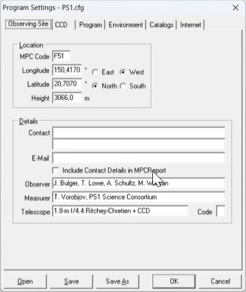
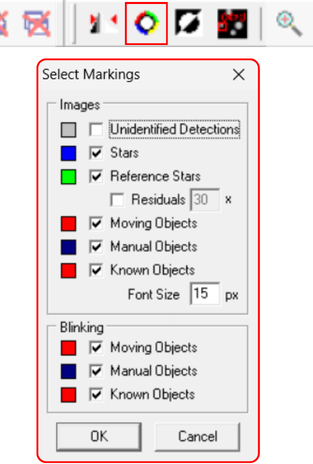
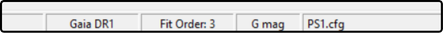

# Getting started

This page was created to guide participants at the beginning of their journey in the program. The first step is to get familiar with the program website and install the *Astrometrica* software.

If you want, you can also follow a video version of this process available on the program’s YouTube channel: [https://www.youtube.com/watch?v=NFQ8b3Fnf0Y](https://www.youtube.com/watch?v=NFQ8b3Fnf0Y).

## IASC website

The program website is where you can install *Astrometrica*, access the images that will be analyzed, and submit your results. The site can be accessed here: [https://iasc.cosmosearch.org](https://iasc.cosmosearch.org).

Each stage of the training will explain what to do on the site.

## Downloading *Astrometrica*

Inside the IASC website, click on the section called **Astrometrica**. There, click the *Astrometrica Setup* button according to your version of Windows to start the download.

After the download is complete, extract the files from the compressed folder and run the installation file *setup.exe*.

Then simply follow the installer instructions to complete the software installation. After installation, just open *Astrometrica* using the shortcut created on the desktop.

⚠️ **Attention:** We do not recommend installing *Astrometrica* in a location different from the one suggested by the installer, in order to avoid configuration problems and future error-solving issues.

After the software opens, press **Yes** on the message asking to clear the report files. This should be done every time you open the program to ensure that previous analysis files are cleared and do not cause confusion with new results.

## Configuring *Astrometrica*

The first time you open *Astrometrica*, you need to configure the software so that it works properly. To do this, follow the steps below:

1. Registration for use

You can use *Astrometrica* for free for 100 days. However, for continued use after that, a registration license is required. For program participants, the license is free and sent by email to the team leader. If you have not yet received the license, contact the training team to request the registration code.

To enter the license, click **Help** → **Registration** and enter the registration code provided.

2. Configuration

Click the first icon on the top toolbar to access the software settings. 🔧 **Edit Program Settings**.

- Go to the **Program** tab and select **Gaia DR1** as the **Star Catalog**;
- Then, in the **CCD** tab, under **Color Band**, select **Gaia Broadband (G)**;
- Finally, you need to choose the configuration file for image analysis. To do this, click the **Open** button (if necessary, navigate to the folder where *Astrometrica* was installed, then open the **Settings** folder) and select the file **PS1.cfg**. During the campaign, images may use either the PS1 or PS2 configuration, indicated in each image’s file name. Whenever necessary, repeat this process to select the correct file for the image you are going to analyze. This will be explained further ahead.
- Click **Save** and then **OK** to complete the configuration.

Now, back on the main software screen, click the eighth icon on the top toolbar, **Select Markings**. The image below shows the recommended configuration for this step, with the marking options indicated. After configuring it, click **Ok** to finish.

At the end, in the bottom right corner of the screen, the settings should be displayed as follows:

Done! Your software is configured and ready to start image analysis. In the next steps, you will learn how to access the images, open them in *Astrometrica*, and follow the general analysis workflow to obtain the expected results. Happy hunting! 🧑‍🚀☄️

## Next step

After completing this initial setup, move on to the practical part of the documentation, especially the page **General analysis workflow**, where the complete process will be explained in an organized way.