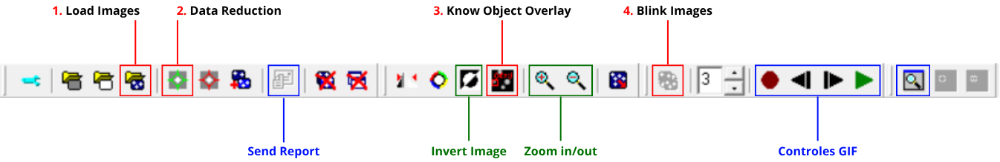

# Opening the images

## Downloading the images

First, you need to access the place where the images are available, the [IASC](https://www.iasc.org.br/) website. There, click **Log in** and enter the credentials sent by email to the team leader. Then click the **Campaigns** tab and select the campaign corresponding to the stage in which you are participating. In the case of Caça Asteroides MCTI, it will be something like *MCTI 2026 Asteroid Search Campaign*.

On the campaign page, there is an organization by teams, meaning that each team has its own numbering and section. Your team number is also sent by email. Click on the section corresponding to your team to access the images that must be analyzed.

On this page, you will find the images available for download. **⚠️ Important:** The images are released in batches throughout the campaign month. At the beginning, only the practice image will be available. The images for analysis will be made available later, according to the schedule and depending on how quickly the practice report is submitted.

As a tip, we recommend that participants create organized folders for each campaign and stage to make file access and organization easier. After downloading the image package, you need to extract the compressed file so that the images can later be accessed in *Astrometrica*.

## Analyzing the images

When you open *Astrometrica*, you will see the following toolbar:

Highlighted in red and numbered in order are the icons needed to open and prepare a set of images for analysis.

1. **Load Images**: Click this icon to open the image set. Navigate to the folder where the images were extracted and select the four images.
2. **Data Reduction**: This icon is used to calibrate the images, that is, to identify the background stars and establish a reference for the analysis. Click this icon to start the calibration process. ⚠️ It is common for the following error to appear:

Just select the middle option. If that does not work, look for help in the FAQ section or contact the support team.

3. **Know Object Overlay**: This icon is used to overlay the positions of known objects, that is, to identify which points in the image correspond to already cataloged asteroids. Click this icon to perform this step.
4. **Blink Current Images**: This icon is used to quickly alternate between the images, allowing you to observe the differences between them. Click this icon to start the "blink" view, that is, to switch between the images and make it easier to identify moving objects.

Done! The images are now open and prepared for analysis. In the next step, you will learn how to observe the images and identify the signs that indicate the presence of an asteroid. Continue to **Finding asteroids**.