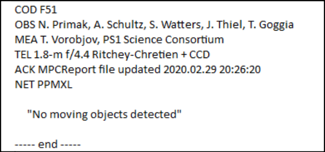

# Submitting report

Let’s understand how to submit the report! **Only one report must be submitted per image package.** In other words, the report should be submitted only after all objects have been marked and named in *Astrometrica*.

In *Astrometrica*, click the **Report** icon to open the report window. **Under no circumstances click "Send".** Only copy all the text that appears there.

Then, on your team’s page on the IASC website, there is a field at the bottom of the page where you can paste the report. Select which image package was analyzed and add the names of the participants who contributed to the analysis.

* Each participant’s name must be written in full and with capitalized initials, for example, "John Michael Doe".

Finally, paste the report copied from *Astrometrica* and click **Submit** to send the report. Done! The report has been submitted and will be evaluated by the IASC analysis team.

⚠️ After submitting the report for an image package, in *Astrometrica*, click **Files** and then **Reset Files** to clear the marked objects and begin analyzing the next image package. If you do not do this, the objects marked in the previous package will remain marked, which may cause confusion and errors in the analysis of the next image package.

## Images without asteroids

If an image package does not contain any object that meets the criteria to be considered an asteroid, a report must still be submitted.

To do this, click on any random point in the image to mark an object. Give it any name, for example, "XXX0000", and click **Accept** to confirm the object name. This is only done so that the software can generate a report.

Then, copy the generated report and paste it into the report submission field on the IASC website, following the same process described above. However, in this case, delete the line referring to the marked object and write "No moving objects detected" to indicate that no moving objects were found in the images. Then click **Submit** to send the report.

## Conclusion

Done! By the end of these sections, you have learned how to open the images, identify and mark asteroids, and submit the analysis report. Now it is time to put what you have learned into practice! Good luck and happy hunting!