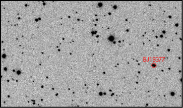
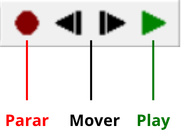
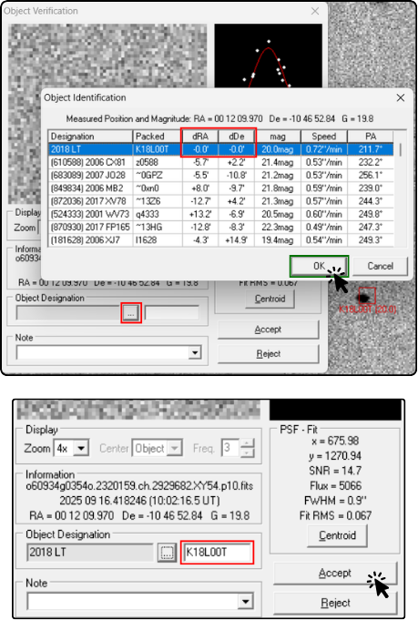

# Marking an asteroid

It is very important for participants to understand that not every object that appears to move in the images is an asteroid. There are several artifacts and phenomena that can generate false positives, that is, signals that seem to indicate the presence of an asteroid but are actually caused by other factors. For this reason, it is essential to learn how to identify these signals and distinguish them from a real asteroid.

## Identifying an asteroid

To identify an object as an asteroid, it must have the following characteristics:

- It moves in a straight line
- It moves at a constant speed
- It appears in at least three of the four images
- It maintains the same brightness and shape in all images

We can observe an example of an object that shows these characteristics:

In this example, the object in question moves in a straight line, at a constant speed, appears in all the images, and maintains the same brightness and shape. These are strong signs that it is an asteroid. ⚠️ However, here it appears 6 times. In the cases we work with, the maximum number of appearances is 4, because there are 4 images.

All right, now that we have confirmed how to identify an asteroid, let’s learn how to mark it in *Astrometrica* so that it is included in the analysis report.

## Marking an asteroid

The process of marking an asteroid in *Astrometrica* is quite simple. To make visualization easier, it is recommended to use the GIF control bar, which allows you to pause and advance frame by frame, so you can observe the object’s motion more precisely.

First, click with the mouse on the object you want to mark.

Then click the ellipsis button (...) that appears next to *Object Designation* to inspect nearby objects. At this point, there are two possibilities: (a) the object is close to a known object, meaning an already cataloged asteroid, or (b) the object is not close to any known object.

### Case (a): The object is close to a known object

- The object at the top of the list is the one closest to the object you marked. If the values in *dRa* and *dDec* are smaller than 0.2, this indicates that the object you marked is very close to a known object, that is, an already cataloged asteroid. In this case, select the object and click **Ok**. The object you marked will automatically be associated with the known object.

- After clicking **Ok**, the cataloged name will automatically appear in the *Object Designation* field. Do not change this name, and click **Accept**.

### Case (b): The object is not close to any known object

- If the object you marked is not close to any known object, that is, if the values in *dRa* and *dDec* are greater than 0.2, this indicates that the object you marked is a candidate for a new asteroid. In this case, click **Cancel** to close the nearby objects window.

- Give the object a name by entering 3 letters (usually representing the initials of the team name) followed by 4 numbers, for example, *ABC0001*. Then click **Accept** to confirm the object name.

- ⚠️ The name **must** contain 3 letters and 4 numbers. We usually recommend naming discoveries in sequence during the campaign, starting with 0001, then 0002, and so on. This makes it easier to organize and keep track of the marked objects.

In both cases, you must repeat the naming procedure for all appearances of the object in the image package. In other words, use the GIF controls to advance frame by frame and mark the object in each image, associating it with the same name. This way, the object will be correctly identified and included in the analysis report.

Done, one object has been named. Continue looking for other objects until you are sure that you have found all the asteroids present in the images. The next step is submitting the report, so continue to **Submitting report**.